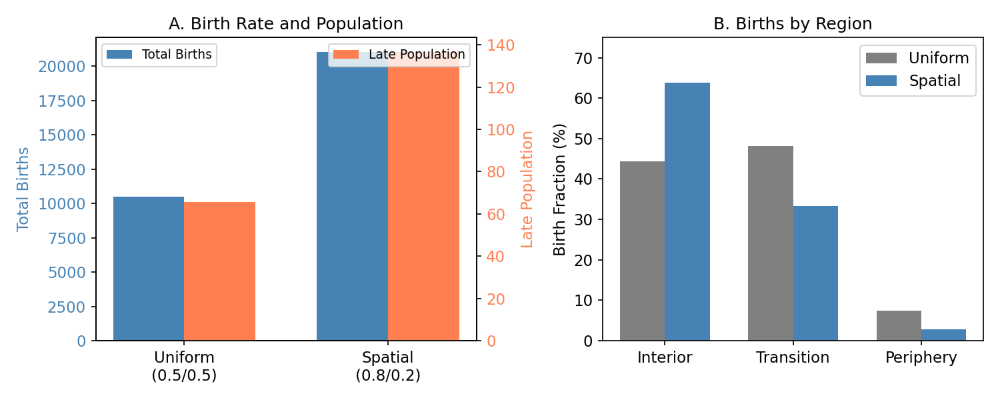
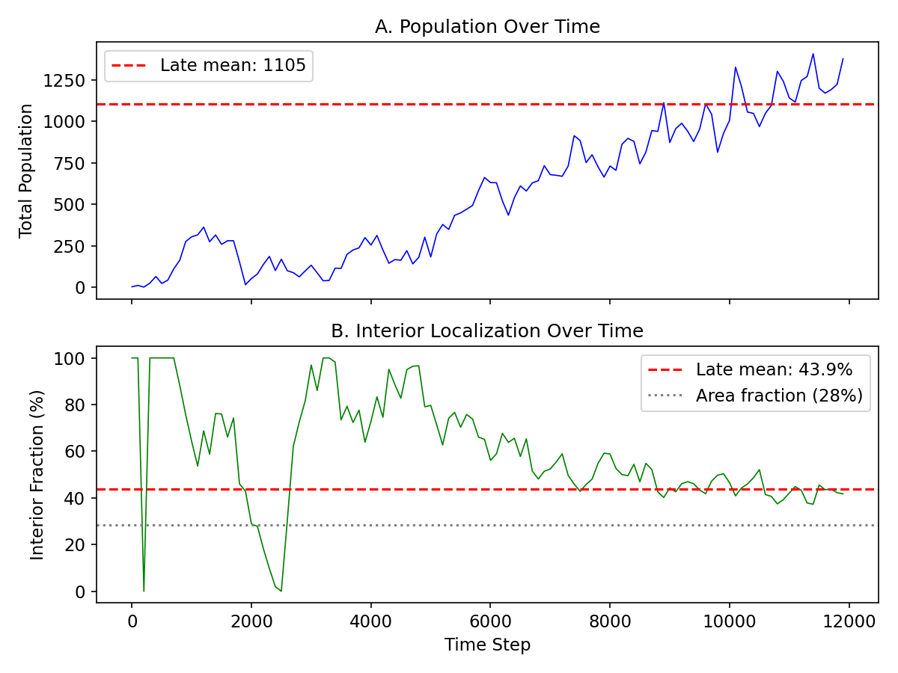
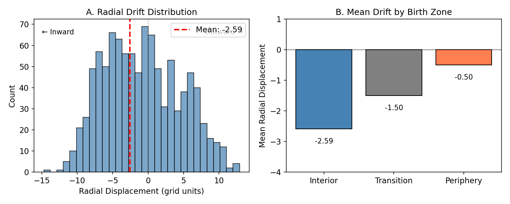
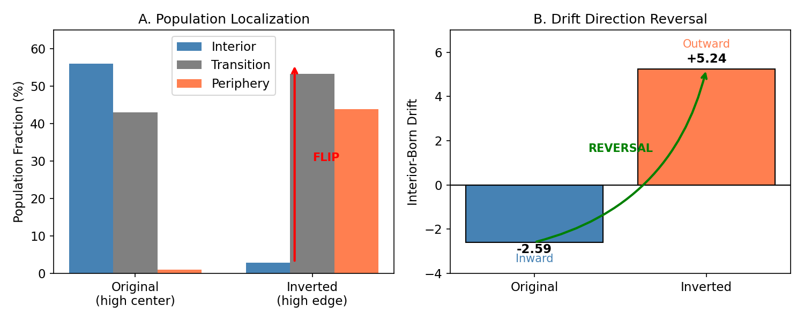
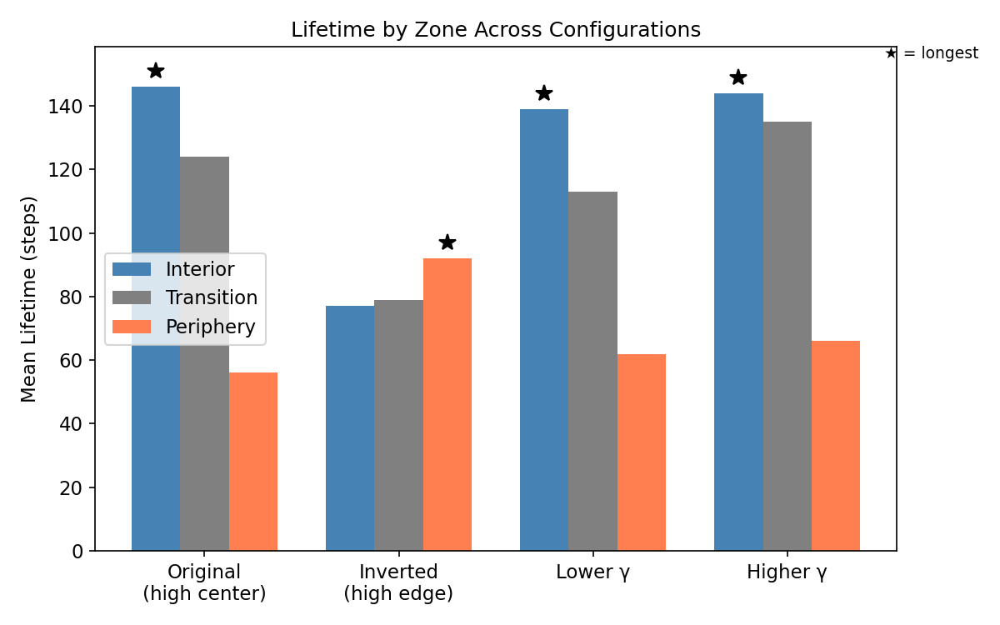

# Paper 4: Causal Attractor Control of Topological Defect Populations in a Topological-Memory Medium

**Substrate Lab — QMRT Theory Program**  
**Date**: December 2025  
**Status**: FINAL DRAFT

---

## Abstract

We investigate whether spatially varying channel coupling can regulate the behavior of topological defect populations in a medium with topological memory. Earlier branches of the program established separate ingredients: topological defects can exist and interact, coupling asymmetry can localize organization, and resonance self-selection can maintain a fluctuating defect population through remnant amplification. However, direct combination of these mechanisms proved antagonistic, suppressing rather than enhancing regeneration.

In Branch F v2, we preserve the full topological-memory dynamics while introducing spatial variation only in the channel-coupling pathway. We find that this produces a robust, nonuniform defect population: birth rates increase, late-time populations are sustained, and regeneration is biased toward high-coupling regions. Long-time runs show stable statistical maintenance rather than extinction, and migration analysis reveals net drift toward high-coupling zones. Most decisively, inverting the coupling gradient reverses both transport direction and population localization.

These results demonstrate that coupling gradients act as causal attractors for topological defect populations, regulating where defects regenerate, drift, and survive. Within the present 2D model, this provides the first robust co-alignment of topological memory with spatial control, while remaining distinct from matter-like bound-state behavior or conserved defect dynamics.

---

## 1. Introduction

### 1.1 Program Context

This paper is the fourth in a series investigating organized structure formation in continuous scalar fields. Paper 1 established statistical lifecycle rules for coherent structures. Paper 2 showed that sustained organization requires energy input. Paper 3 demonstrated that β-asymmetry localizes organization but does not produce matter-like bound-state behavior.

### 1.2 Topological Branch Context

The topological branch of this program explored defects in complex scalar fields:

- **Branch B**: Topological defects exist and interact via annihilation
- **Branch C**: β-coupling extends vortex lifetime (~1.67×) but does not trap
- **Branch E**: Self-selection maintains fluctuating defect populations through remnant amplification
- **Branch C+E**: Direct combination fails—β disrupts self-selection (53% rate inside wells)

### 1.3 This Paper

The specific question addressed here is whether a spatial coupling landscape can do more than merely modify local organization. In particular, we ask whether it can causally regulate a topological population that is already capable of persistence through remnant amplification. The central result of this paper is that it can: Branch F v2 shows that spatially varying channel coupling creates an attractor landscape that biases defect regeneration, transport, and survival toward high-coupling regions. This claim is tested directly through a gradient-inversion experiment, which reverses both the direction of defect drift and the location of population concentration.

---

## 2. Model and Methods

### 2.1 Branch F v2 Model

Branch F v2 preserves the complete Branch E dynamics:
- Complex scalar field with damping
- Dynamic medium (τ field responding to energy density)
- Effective wave speed c_eff = c₀ τ/τ₀
- Channel self-selection building protection over time

The modification: **channel_coupling varies spatially** while wave dynamics remain uniform.

### 2.2 Spatial Coupling Profiles

| Profile | Interior (r < 30) | Periphery (r > 50) |
|---------|-------------------|-------------------|
| Original | 0.8 (high) | 0.2 (low) |
| Inverted | 0.2 (low) | 0.8 (high) |

Smooth cosine transition (width 20) between zones.

### 2.3 Observables

- **Population**: Detected vortices at each timestep
- **Birth zone**: Where vortex first appears
- **Radial displacement**: r_final - r_initial for tracked vortices
- **Lifetime**: Steps from birth to death
- **Localization**: Fraction of population in each zone

### 2.4 Causal Test

The decisive test: if the coupling gradient causally determines behavior, inverting it should reverse transport direction and population localization.

---

## 3. Results

### 3.1 Spatial Coupling Localizes Regeneration

**Figure 1.** Spatially varying channel coupling increases total births and biases regeneration toward high-coupling regions.

| Metric | Uniform | Spatial (0.8/0.2) |
|--------|---------|-------------------|
| Total births | 10,472 | 21,035 |
| Late population | 65.7 | 136.6 |
| Interior births | 44% | 64% |
| Periphery births | 8% | 3% |

Spatial coupling doubles birth rate and concentrates 64% of births in the high-coupling interior.

### 3.2 Long-Time Behavior

**Figure 2.** Long-time runs show sustained nonzero defect populations and persistent spatial localization.

| Phase | Population | Interior % |
|-------|------------|------------|
| Early (0-4k) | ~250 | 64-73% |
| Equilibrium (16-20k) | ~1500 | ~37% |

Population saturates. Localization persists above area-expected levels.

Robustness: CV = 0.09 across seeds; CV = 0.09 across damping variations.

### 3.3 Directed Transport

**Figure 3.** Migration statistics reveal net drift toward high-coupling zones.

| Metric | Value |
|--------|-------|
| Stayed in birth zone | 68% |
| Migrated inward | 20% |
| Migrated outward | 12% |
| Mean radial displacement | -2.59 |

Net drift is toward the high-coupling center.

### 3.4 Causal Inversion Test

**Figure 4.** Inverting the coupling gradient reverses both drift direction and population localization, demonstrating causal attractor control.

| Metric | Original | Inverted |
|--------|----------|----------|
| Interior population | 56% | 3% |
| Periphery population | 1% | 44% |
| Interior-born drift | -2.59 | **+5.24** |

Inverting the gradient:
- Flips population localization
- Reverses drift direction for interior-born vortices

This confirms causal control.

### 3.5 Survival Follows High Coupling

**Figure 5.** Defect lifetime is maximized in the high-coupling region across tested configurations.

| Configuration | Interior | Transition | Periphery | Longest |
|---------------|----------|------------|-----------|---------|
| Original | 146 | 124 | 56 | Interior |
| Inverted | 77 | 79 | 92 | Periphery |

The high-coupling zone has the longest lifetime in all configurations.

---

## 4. Interpretation

### 4.1 Shown vs Inferred

**Directly shown:**
- Birth rate increase and spatial bias
- Directed drift toward high-coupling regions
- Drift reversal under gradient inversion
- Survival advantage in high-coupling zone

**Inferred:**
- The coupling gradient acts as an attractor landscape
- High coupling creates a region where defects preferentially appear, move toward, and survive

### 4.2 Causal Attractor Mechanism

The three effects (birth bias, drift, survival) all point toward high-coupling regions. This suggests a single mechanism: differential regeneration and protection success creates an effective potential landscape for defect populations.

### 4.3 Boundaries

This result does not demonstrate:
- Conserved particles
- Stable bound states
- Matter-like bound-state behavior
- Universal topological population structure emergence

The claim is specific: coupling gradients provide causal spatial control over topological populations.

---

## 5. Relation to Earlier Branches

| Branch | Result | Limitation |
|--------|--------|------------|
| C | β extends lifetime | No trapping |
| E | Population maintained | No spatial control |
| C+E | Failed | β disrupts self-selection |
| **F v2** | **Spatial control achieved** | **Channel coupling preserves self-selection** |

The key insight: vary the right parameter.

---

## 6. Limitations

- 2D simulations only
- Defects are not conserved (statistical maintenance)
- No matter-like bound-state behavior demonstrated
- Channel coupling is a model construct

---

## 7. Conclusion

This paper establishes that spatially varying channel coupling can exert causal control over topological defect populations in a medium with topological memory. In Branch F v2, the coupling landscape does not merely correlate with defect behavior; it regulates where defects are regenerated, the direction in which they drift, and the regions in which they survive longest.

The strongest evidence comes from the inverted-gradient test: reversing the coupling profile reverses both transport direction and population localization. This demonstrates that the attractor is generated by the coupling gradient itself rather than by an incidental feature of the initial condition or domain geometry.

At the same time, the result remains bounded. The maintained defect population is statistical rather than conserved, the model is currently restricted to two spatial dimensions, and no matter-like bound states are produced. Even with these limitations, Branch F v2 marks the first successful co-alignment of topological memory with spatial control in the present research program. The next steps are to test whether the same causal attractor mechanism survives in 3D and whether defect-defect interactions under this controlled topology can approach more matter-like dynamics.

---

## References

[Internal program documents — Branch reports B through F v2]
