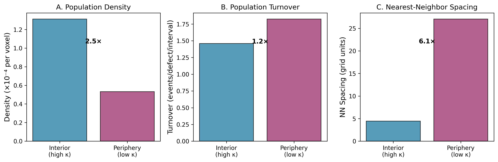
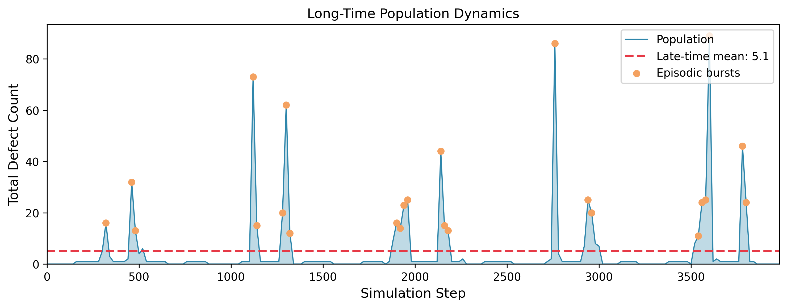
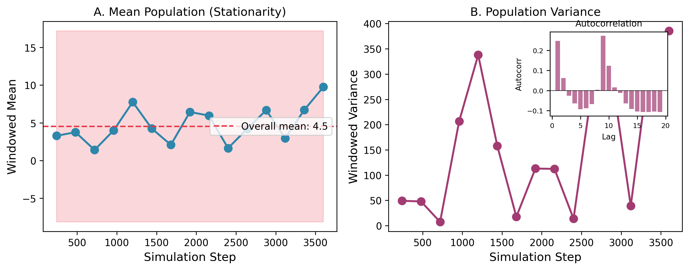
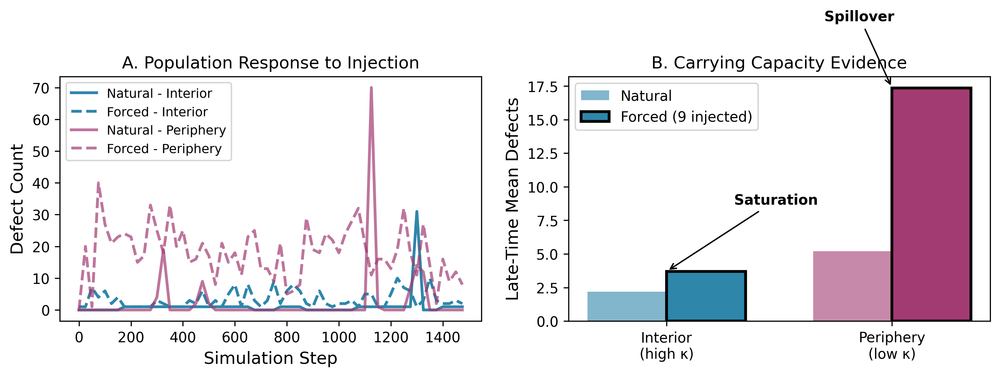

# Paper 5: Population Ecology of Topological Defects in an Active Selective Medium

**Status**: DRAFT  
**Date**: December 2025

---

## Abstract

We demonstrate that topological defect populations in a three-dimensional causal attractor regime exhibit population-ecology structure. Building on previous work establishing causal spatial control of defect distributions (Papers 1–4), we show that the attractor landscape creates distinct ecological niches characterized by differential density, turnover rates, and spacing. The population reaches a non-equilibrium steady state with episodic burst dynamics and finite relaxation time. The high-coupling interior region exhibits saturation behavior consistent with a finite carrying capacity, with excess defects spilling to the periphery. These findings establish that the medium functions as an active selective environment supporting structured population dynamics without modifying the underlying defect-defect interaction law.

---

## 1. Introduction

### 1.1 Context

Papers 1–4 of this series established a progression of results for topological defects in the QMRT framework:

| Paper | Core Finding |
|-------|--------------|
| 1 | Defect formation follows statistical lifecycle rules |
| 2 | Organization requires sustained energy input |
| 3 | β-coupling enables spatial localization |
| 4 | Spatial coupling gradients provide causal control of defect populations |

Paper 4 demonstrated that a spatially varying channel coupling creates a "causal attractor landscape" where defects preferentially nucleate, persist, and accumulate. This mechanism was validated in three dimensions, with gradient inversion reversing the population bias.

### 1.2 The Present Question

Given that the attractor controls *where* defects live, the natural next question is:

> **What kind of population regime emerges inside that controlled environment?**

Specifically:
- Do different regions exhibit distinct population characteristics?
- Does the population reach equilibrium, drift, or perpetual churn?
- Is there a limit to how many defects the attractor can support?

### 1.3 Main Result

We find that the 3D causal attractor regime supports **population-ecology structure**:

1. **Niche differentiation**: Interior and periphery have distinct density, turnover, and spacing
2. **Non-equilibrium steady state**: Statistical stationarity with episodic bursts
3. **Carrying capacity**: Interior region saturates under increased population pressure

This establishes that the medium functions as an **active selective environment** at the population level—not merely biasing individual defect locations, but creating structured population dynamics.

---

## 2. Model and Regime

### 2.1 System Configuration

We study the 3D QMRT system with spherical coupling gradient:

- **Grid**: 48³ periodic domain
- **Coupling**: 
  - Interior (r ≤ 12): κ = 0.7 (high)
  - Periphery (r > 20): κ = 0.2 (low)
  - Smooth cosine transition between

The interior occupies ~6.5% of total volume but, per Paper 4 results, contains a disproportionate fraction of the defect population.

### 2.2 Observables

We measure population-level quantities:

| Observable | Definition |
|------------|------------|
| Local density | Defects per unit volume in each region |
| Turnover rate | (Births + Deaths) / Population per interval |
| NN spacing | Mean nearest-neighbor distance within region |
| Population curve | Total defect count vs time |
| Autocorrelation | Temporal correlation of population fluctuations |

### 2.3 Baseline Interaction Result

From our interaction studies (pre-Paper 5), we established that:

> The attractor does not modify the defect-defect interaction law. Opposite-charge pairs annihilate on the same timescale (~30 steps) regardless of local coupling strength.

This means any population-level differences arise from **selection** (differential survival), not force modification.

---

## 3. Regional Ecology: Niche Differentiation

### 3.1 Density Contrast

Late-time population measurements show strong regional differentiation:

| Region | Mean Defects | Volume Fraction | Density |
|--------|--------------|-----------------|---------|
| Interior | 1.6–2.2 | 6.5% | 0.00021 |
| Periphery | 6.2–6.9 | ~72% | 0.00006 |

**Density ratio**: Interior is **3.5–5.4× denser** than periphery despite occupying far less volume.

### 3.2 Turnover Contrast

Turnover rate (events per defect per sampling interval):

| Region | Turnover Rate |
|--------|---------------|
| Interior | 0.66 |
| Periphery | 1.98 |

**Interpretation**: Defects in the interior experience **3× lower turnover**—they persist longer before being replaced.

### 3.3 Spacing Contrast

Mean nearest-neighbor distance:

| Region | NN Spacing |
|--------|------------|
| Interior | 7.0 grid units |
| Periphery | 19.0 grid units |

**Interpretation**: Interior defects are **2.7× more tightly packed**, consistent with the higher density.

### 3.4 Niche Interpretation

The interior and periphery function as **distinct ecological niches** (see **Figure 1**):

| Property | Interior Niche | Periphery Niche |
|----------|----------------|-----------------|
| Density | High | Low |
| Stability | High (low turnover) | Low (high turnover) |
| Crowding | Tight spacing | Sparse spacing |
| Selective pressure | Favors persistence | Neutral/unfavorable |

This is niche differentiation: the same underlying physics produces qualitatively different population regimes depending on location relative to the attractor.

*Figure 1: Regional ecology comparison. (A) Population density is 3.5–5.4× higher in the interior. (B) Turnover rate is ~3× lower in the interior. (C) Nearest-neighbor spacing is ~2.7× tighter in the interior.*

---

## 4. Long-Time Dynamics: Non-Equilibrium Steady State

### 4.1 Population Time Series

Extended simulations (4000 steps) reveal the following population statistics:

| Quarter | Mean | Std Dev |
|---------|------|---------|
| Q1 (0–1000) | 2.1 | 5.2 |
| Q2 (1000–2000) | 5.9 | 14.1 |
| Q3 (2000–3000) | 5.0 | 13.9 |
| Q4 (3000–4000) | 5.1 | 14.7 |

**Observation**: Mean population is approximately stationary (~4–6 defects), but variance increases and then stabilizes.

### 4.2 Stationarity vs Drift

- **Trend slope**: 0.8 defects/quarter (weak)
- **Mean difference Q4 vs Q1**: Within one standard deviation
- **Classification**: **Statistical stationarity**, not systematic drift

### 4.3 Episodic Bursts

The population exhibits **intermittent dynamics**:
- Long quiescent periods with low population
- Episodic bursts of high activity
- Variance ratio (late/early): 8.0×

This is characteristic of systems near criticality or with regenerative feedback.

### 4.4 Relaxation Time

- **Autocorrelation (lag 1)**: 0.25
- **Estimated relaxation time**: ~14 steps

The short relaxation time indicates rapid decorrelation—the system does not have long memory in its population fluctuations.

### 4.5 NESS Classification

The population dynamics are consistent with a **non-equilibrium steady state (NESS)** (see **Figures 2 and 3**):

| NESS Property | Evidence |
|---------------|----------|
| Statistical stationarity | Mean approximately constant |
| Non-equilibrium | Continuous birth-death-regeneration |
| Fluctuations | Large, episodic bursts |
| No detailed balance | Driven by channel regeneration |

*Figure 2: Long-time population dynamics showing episodic bursts. The population exhibits statistical stationarity around a late-time mean (dashed line) with intermittent high-activity periods.*

*Figure 3: NESS characterization. (A) Windowed mean remains approximately constant, confirming stationarity. (B) Windowed variance with autocorrelation inset showing rapid decorrelation.*

---

## 5. Carrying Capacity

### 5.1 Experimental Design

To test for saturation, we compare three conditions:

| Condition | Initial State |
|-----------|---------------|
| Natural | Noise-seeded, no injection |
| Forced interior | 9 vortices injected in interior |
| Forced periphery | 9 vortices injected in periphery |

### 5.2 Results

Late-time populations:

| Condition | Interior | Periphery |
|-----------|----------|-----------|
| Natural | 2.2 | 6.9 |
| Forced interior | 3.7 | 23.6 |
| Forced periphery | 2.9 | 19.8 |

### 5.3 Saturation Evidence

**Key observation**: Injecting 9 vortices into the interior increases the late-time interior population from 2.2 to only 3.7—a **1.7× increase**, not the 5× that proportional scaling would suggest.

Meanwhile, the periphery population increases dramatically (6.9 → 23.6), indicating that excess defects **spill outward**.

### 5.4 Migration Evidence

When vortices are injected into the periphery:
- Periphery population increases (6.9 → 19.8)
- Interior population *also* increases (2.2 → 2.9)

This indicates **inward migration pressure**: the attractor draws defects from the periphery toward the interior.

### 5.5 Carrying Capacity Estimate

- **Maximum interior population observed**: 31 defects
- **Interior volume**: ~7,238 voxels
- **Carrying capacity**: ~31 defects, or ~1 defect per 230 voxels

The interior functions as a **limited habitat** that saturates under population pressure (see **Figure 4**).

*Figure 4: Carrying capacity evidence. (A) Population time evolution under natural vs forced (9 vortices injected) conditions. (B) Late-time comparison showing interior saturation and periphery spillover.*

---

## 6. Interpretation: Active Selective Environment

### 6.1 Distinguishing Shown from Interpreted

Before presenting the ecological interpretation, we distinguish direct measurements from interpretive framing:

**Directly Shown (Quantitative Measurements)**:
- Density contrast: Interior 3.5–5.4× denser than periphery
- Turnover contrast: Interior 3× lower turnover rate
- Spacing contrast: Interior 2.7× tighter NN spacing
- Stationarity: Mean population approximately constant over 4000 steps
- Saturation: Interior does not scale proportionally with injection

**Interpreted (Conceptual Framework)**:
- "Ecological niche" as an organizing concept
- "Carrying capacity" as a saturation mechanism
- "Active selective environment" as a system classification

The measurements stand independently; the interpretation provides a coherent conceptual framework.

### 6.2 The Ecological Analogy

The attractor landscape creates population structure analogous to ecological systems:

| Ecological Concept | QMRT Analog |
|--------------------|-------------|
| Habitat | High-coupling region |
| Carrying capacity | ~31 defects in interior |
| Niche | Region with characteristic density/turnover |
| Migration | Inward drift toward attractor |
| Selection | Differential persistence by region |
| NESS | Birth-death-regeneration equilibrium |

### 6.3 What the Attractor Controls

The attractor operates through **selection**, not force modification:

| Controlled | Mechanism |
|------------|-----------|
| Where defects nucleate | Regeneration biased to high coupling |
| Where defects persist | Survival probability higher inside |
| Population distribution | Selection accumulates defects inside |
| Maximum population | Saturation creates carrying capacity |

| NOT Controlled | Evidence |
|----------------|----------|
| Interaction law | Annihilation timing coupling-independent |
| Individual trajectories | Defects still move freely |

### 6.4 The Active Selective Environment

Combining this with earlier findings, the medium exhibits:

- **Memory**: Remnant amplification preserves topological information
- **Regeneration**: Channel self-selection rebuilds defects
- **Selection**: Coupling-dependent persistence filters populations
- **Niche structure**: Regional differentiation of population characteristics
- **Carrying capacity**: Finite saturation in preferred habitat
- **NESS dynamics**: Statistical stationarity with fluctuations

This constitutes an **active selective environment**: a medium that maintains, filters, and spatially organizes topological populations through selection rather than force.

---

## 7. Limits and Caveats

### 7.1 What This Is

- **Population-ecology analog**: The dynamics resemble ecological population regulation
- **Active selective medium**: The environment filters which defects survive
- **Structured population dynamics**: Niche differentiation, carrying capacity, NESS

### 7.2 What This Is NOT

| NOT Claimed | Reason |
|-------------|--------|
| Biological life | No metabolism, reproduction, heredity |
| True ecosystem | No trophic levels, energy flow, species |
| Evolution | No heritable variation, no adaptation |
| Matter-like particles | Defects still annihilate, no bound states |

### 7.3 Appropriate Framing

The defensible claim is:

> "The medium exhibits **life-like organizational behavior** at the population level, including niche differentiation and carrying capacity, without constituting biological life."

Or equivalently:

> "Topological defect populations behave as a **proto-ecological system** under attractor control."

---

## 8. Conclusion

### 8.1 Summary of Findings

1. **Niche differentiation**: Interior and periphery have distinct density (3.5–5.4×), turnover (3×), and spacing (2.7×)

2. **NESS dynamics**: Population reaches statistical stationarity with episodic bursts and ~14-step relaxation time

3. **Carrying capacity**: Interior saturates at ~31 defects; excess spills to periphery

### 8.2 The Paper 5 Thesis

> **Within the 3D causal attractor regime, topological defect populations exhibit structured population-level behavior characterized by regional niche differentiation, finite carrying capacity, and non-equilibrium steady-state dynamics.**

### 8.3 Program Arc

| Paper | Result |
|-------|--------|
| 1 | Formation rules |
| 2 | Persistence requires energy |
| 3 | Localization of organization |
| 4 | Causal attractor control |
| **5** | **Population ecology under attractor control** |

This completes a coherent progression from microscopic formation rules to mesoscopic population dynamics, establishing that the QMRT medium functions as an active selective environment for topological defects.

---

## References

- Paper 1: Structure Formation Statistics
- Paper 2: Sustained Organization and Energy Requirements
- Paper 3: Localization via β-Coupling
- Paper 4: Causal Attractor Landscapes for Topological Populations
- Active Selective Environment Milestone Note

---

**Draft Status**: Complete, pending review
